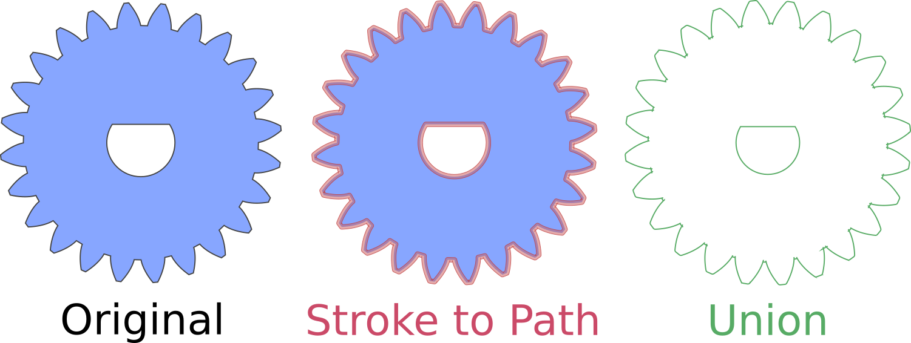

# inkscape-kerf-adjuster

creates a kerf-adjusted copy of selected path(s), so that a laser-cut part can be the exact size that was intended

#Installation
Copy the contents of `src/` to your Inkscape `extensions/` folder.

#Usage
Extensions > Generate from Path > Adjust for Lasercutter Kerf...
